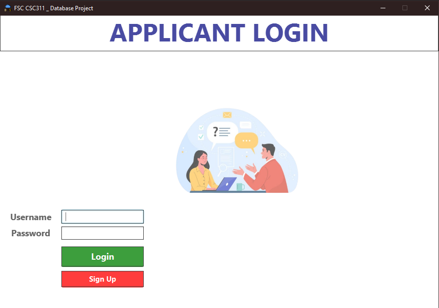

## Applicant Review System
A simple applicant management program that utilizes JavaFX to handle applicant information such as names, emails, majors, and other information. It allows users to add, remove, clear, and edit information as well as export and import CSV files.



## Features

- **User Management** : Add, edit, delete, and clear applicant information in a database.
- **Image Upload** : Upload images associated with each user record.
- **CSV Import / Export** : Export user data to a CSV file or import user data from CSV files.
- **Keyboard Shortcuts** : Use keyboard shortcuts such as
```
CTRL + C : Copy information to clipboard
CTRL + E : Edit information of an applicant
CTRL + D : Delete information of an applicant
CTRL + R : Clear all applicant information from the program
````
- **Light Mode / Dark Mode** : Switch between light and dark mode.

## Setup & Installation
### 1. Clone the Repository
```bash
git clone https://github.com/yourusername/database-management-javafx.git
```
### 2. Setup MySQL Database
- Create a MySQL database(if not already created) using the `DbConnectivityClass` class to automatically create the necessary tables.
```dbn-sql
CREATE DATABASE IF NOT EXISTS user_database;
USE user_database;
```
The program will automatically create the database and a table names `users` to store the information.
### 3. Build the Project
If you're using IntelliJ Idea:
- Open the project in IntelliJ IDEA.
- Ensure your MySQL JDBC driver is included in your dependencies.
- Build and run the project.
If you prefer to use Maven or Gradle for managing dependencies, ensure you add the necessary configurations in the `pom.xml` (for Maven) or `build.gradle` (for Gradle).

### 4. Run the Application
After setting up the database and building the project, you can run the application.

- The login screen should appear
- After logging in, you can manage records.
- You could also upload profile pictures and export/import CSV files.


